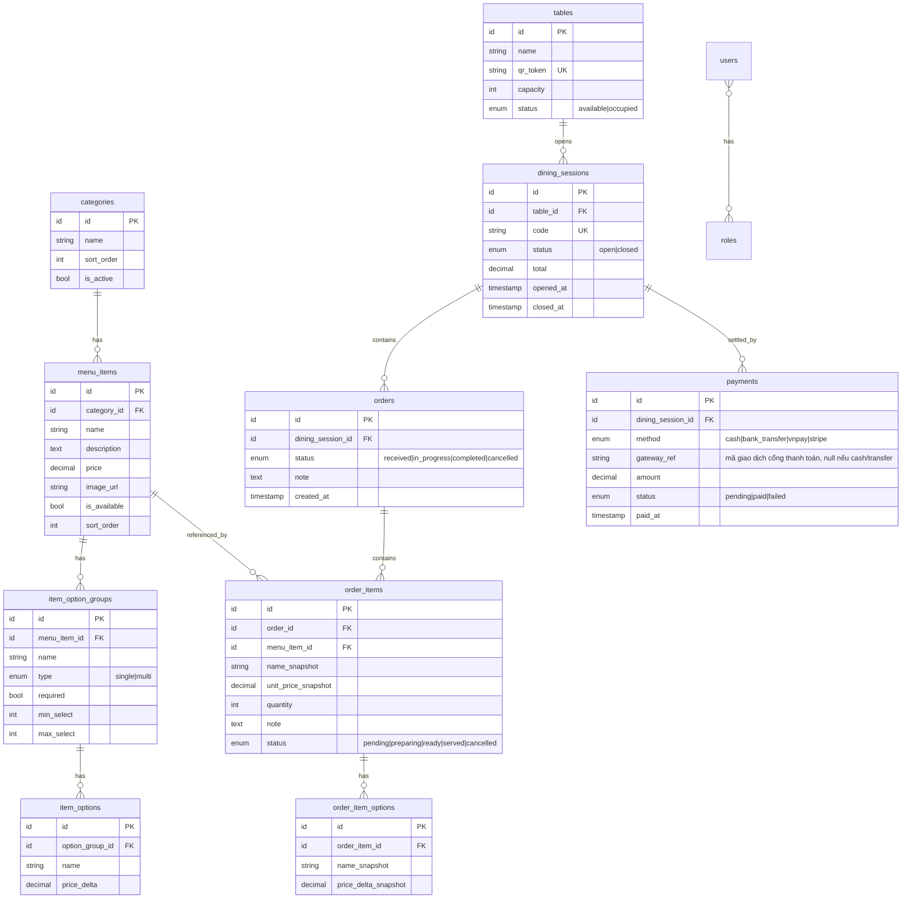

# cafe-connect — QR Menu & Real-time Ordering

Thiết kế chi tiết cho hệ thống gọi món qua QR dành cho **quán cafe**.
Stack: **Laravel 12 + Vue 3**. Định hướng: sản phẩm portfolio hoàn chỉnh, deploy được, và bán được cho quán cafe thật ở VN.

> Tên project: **cafe-connect** — kết nối khách với quầy pha chế ngay tại bàn.

---

## 1. Định vị & phạm vi

**Một câu:** Khách quét QR ở bàn → xem menu → gọi món → **quầy pha chế (barista)** nhận real-time → theo dõi trạng thái đến khi thanh toán.

> Ghi chú thuật ngữ: quán cafe không có "bếp" theo nghĩa nhà hàng, nên trong tài liệu **"bếp" = quầy pha chế / barista**, và **KDS (Kitchen Display System) = màn hình quầy pha chế**. Giữ tên kỹ thuật KDS vì đây là thuật ngữ ngành phổ biến; giao diện hiển thị cho khách/nhân viên thì dùng chữ "quầy pha chế".

Nguyên tắc quan trọng nhất cho project portfolio: **làm một quán (single-tenant) cho MVP**, không làm multi-tenant. Multi-tenant để dành như hướng mở rộng thành SaaS. Cố làm SaaS ngay từ đầu là cách chắc chắn nhất để dự án lại dở dang.

Điểm "ăn điểm" kỹ thuật của dự án này nằm ở **3 chỗ**, hãy làm ba chỗ này thật tốt:
1. **Real-time hai chiều** — order đẩy lên quầy pha chế, trạng thái đẩy ngược về khách.
2. **Phiên bàn (dining session)** — gộp nhiều lần gọi món trong một lượt ngồi vào một hóa đơn.
3. **Snapshot giá** — đơn cũ giữ nguyên giá kể cả khi menu đổi giá sau này.

Ba thứ này là cái phân biệt bạn với một app CRUD tầm thường.

---

## 2. Vai trò (Actors)

| Vai trò | Đăng nhập? | Làm gì |
|---|---|---|
| **Khách (Customer)** | Không | Quét QR, xem menu, gọi món, theo dõi, gọi phục vụ, yêu cầu thanh toán |
| **Quầy pha chế (Barista / KDS)** | Có (staff) | Xem ticket real-time, cập nhật trạng thái từng món |
| **Thu ngân / Phục vụ (Staff)** | Có (staff) | Mở/đóng bàn, xác nhận thanh toán, nhận thông báo "gọi phục vụ" |
| **Chủ quán (Admin)** | Có (admin) | Quản lý menu, bàn, sinh QR, nhân viên, xem báo cáo |

> Gợi ý thu hẹp: trong MVP có thể gộp **Thu ngân + Phục vụ** thành một vai "Staff" và dùng chung màn admin. Chỉ tách khi có thời gian.

---

## 3. Luồng người dùng chính

### 3.1 Khách gọi món
1. Quét QR ở bàn → mở web (PWA mobile-first), URL chứa `qr_token` của bàn.
2. Hệ thống tìm bàn → mở (hoặc gắn vào) **dining session** đang mở của bàn đó.
3. Khách thấy menu theo danh mục: ảnh, giá, mô tả, món hết hàng bị mờ.
4. Chọn món → chọn tùy chọn (size, đường, đá, topping) → ghi chú ("ít cay") → thêm vào giỏ.
5. Xem lại giỏ → **Gọi món**. Đơn gửi đi.
6. Màn theo dõi real-time: mỗi món chạy trạng thái `Đã nhận → Đang làm → Sẵn sàng → Đã phục vụ`.
7. Có thể **gọi thêm** nhiều lần — tất cả gộp vào cùng session/hóa đơn.
8. Nút **Gọi phục vụ** và **Thanh toán** luôn hiện.

### 3.2 Quầy pha chế (KDS — Kitchen Display System)
1. Màn hình lớn hiển thị ticket theo cột trạng thái (kiểu kanban: Mới / Đang làm / Xong).
2. Có **âm thanh báo** khi order mới về.
3. Mỗi ticket: số bàn, danh sách món + số lượng + tùy chọn + ghi chú + thời gian chờ.
4. Bấm để chuyển trạng thái từng món hoặc cả ticket → đẩy ngược về khách ngay.

### 3.3 Admin
1. **Menu**: CRUD danh mục, món, nhóm tùy chọn; bật/tắt "hết hàng" nhanh.
2. **Bàn**: tạo bàn, sinh & tải/in mã QR cho từng bàn.
3. **Đơn hàng**: xem live + lịch sử; đóng bàn khi thanh toán xong.
4. **Báo cáo**: doanh thu theo ngày, món bán chạy, giá trị trung bình mỗi bàn.

---

## 4. Sơ đồ dữ liệu (ERD)



**Chú ý về `*_snapshot`:** khi khách gọi món, ta copy **tên và giá tại thời điểm đó** vào `order_items` / `order_item_options`. Sau này admin đổi giá menu, hóa đơn cũ vẫn đúng. Đây là chi tiết trông "chuyên nghiệp" — nhớ nêu nó trong README.

---

## 5. State machine (máy trạng thái)

```
order_item:  pending → preparing → ready → served
                 └──────────→ cancelled

order:       received → in_progress → completed
                 └──────────→ cancelled   (derive từ order_items)

dining_session:  open → closed   (đóng khi payment.status = paid)

table:  available ⇄ occupied   (occupied khi có session open)
```

`order.status` nên **suy ra (derive)** từ trạng thái các `order_items` con, đừng lưu tay dễ lệch:
- tất cả `served` → `completed`
- có ít nhất một `preparing/ready` → `in_progress`
- còn lại → `received`

---

## 6. Thiết kế API (REST)

### 6.1 Public — khách, không cần đăng nhập
Xác thực bằng `qr_token` (bàn) và `session code`.

```
GET    /api/menu
        → trả về categories + items + option groups + options (kèm is_available)

POST   /api/sessions
        body: { qr_token }
        → tìm bàn, trả về session đang open (tạo mới nếu chưa có)
        → { code, table_name, status }

GET    /api/sessions/{code}
        → { status, orders[], total, items_with_status[] }

POST   /api/sessions/{code}/orders
        body: { items: [{ menu_item_id, quantity, note, options:[option_id] }] }
        → tạo order + order_items (kèm snapshot), broadcast tới bếp

GET    /api/sessions/{code}/orders
        → theo dõi trạng thái (dùng khi WS chưa kết nối / fallback)

POST   /api/sessions/{code}/call-staff        → báo phục vụ
POST   /api/sessions/{code}/request-bill      → yêu cầu thanh toán
```

### 6.2 Admin / Staff — cần đăng nhập (JWT)

Auth bằng **JWT** (khuyến nghị `php-open-source-saver/jwt-auth` — bản fork được maintain của `tymon/jwt-auth`). Flow: `POST /api/auth/login` trả access token; gắn `Authorization: Bearer <token>` cho mọi request admin/kitchen. Có thể thêm refresh token nếu muốn (bạn đã làm pattern này ở project HRM). RBAC vẫn dùng `spatie/laravel-permission`.

```
POST   /api/auth/login          body: { email, password }   → { access_token, expires_in }
POST   /api/auth/refresh        → cấp token mới
POST   /api/auth/logout         → blacklist token hiện tại
GET    /api/auth/me             → thông tin user + roles
```

```
# Menu
GET/POST/PUT/DELETE   /api/admin/categories
GET/POST/PUT/DELETE   /api/admin/menu-items
PATCH                 /api/admin/menu-items/{id}/availability
GET/POST/PUT/DELETE   /api/admin/option-groups
GET/POST/PUT/DELETE   /api/admin/options

# Bàn & QR
GET/POST/PUT/DELETE   /api/admin/tables
POST                  /api/admin/tables/{id}/qr      → sinh qr_token + ảnh QR

# Đơn hàng
GET                   /api/admin/orders               → live + lịch sử (filter)
POST                  /api/admin/sessions/{code}/close
POST                  /api/admin/sessions/{code}/pay  body: { method: "cash"|"bank_transfer", amount }
                                                        → ghi nhận thanh toán tại quầy, đóng session

# Thanh toán online — khách tự thanh toán (mặc định VNPay sandbox; StripeGateway để sẵn theo interface)
POST   /api/sessions/{code}/checkout  body: { gateway: "vnpay"|"stripe" }
        → tạo payment (pending) + trả về URL/redirect tới cổng thanh toán
GET    /api/payments/{gateway}/return  → cổng redirect về sau khi thanh toán (verify chữ ký, cập nhật payment)
POST   /api/payments/{gateway}/webhook → cổng gọi server-to-server xác nhận (nguồn tin cậy để chốt paid)

# Báo cáo
GET                   /api/admin/reports/revenue?from=&to=
GET                   /api/admin/reports/top-items
```

### 6.3 Kitchen
```
GET     /api/kitchen/tickets                          → order_items chưa served, group theo bàn
PATCH   /api/kitchen/order-items/{id}/status          body: { status }
```

---

## 7. Real-time (trọng tâm kỹ thuật)

Dùng **Laravel Reverb** (WebSocket, cùng hệ sinh thái Laravel), self-host trên Fly.io. Với quy mô demo, một instance Reverb thừa sức tải; scale ngang qua Redis (Upstash) khi cần.

### Kênh (channels)
| Kênh | Loại | Ai nghe |
|---|---|---|
| `kitchen` | private | Màn bếp |
| `staff` | private | Phục vụ / thu ngân |
| `session.{code}` | public | Khách của bàn đó |
| `admin.orders` | private | Dashboard admin |

### Sự kiện (events)
| Event | Bắn khi | Đẩy tới |
|---|---|---|
| `OrderPlaced` | Khách gọi món | `kitchen`, `admin.orders` |
| `OrderItemStatusUpdated` | Bếp đổi trạng thái | `session.{code}`, `admin.orders` |
| `StaffCalled` | Khách bấm gọi phục vụ | `staff` |
| `BillRequested` | Khách yêu cầu thanh toán | `staff`, `admin.orders` |
| `SessionClosed` | Thanh toán xong | `session.{code}` |

> Mẹo build: **làm bằng polling trước** (frontend gọi lại API mỗi 3–5s), chạy được toàn bộ luồng, rồi mới thay bằng WebSocket. Cách này giúp bạn không kẹt ở phần khó nhất ngay từ đầu.

---

## 8. Kiến trúc frontend (Vue 3)

Chia làm **3 app / 3 layout** dùng chung API:

- **Customer app** — mobile-first, PWA. Route theo `qr_token`. Nhẹ, load nhanh, ảnh tối ưu.
- **Kitchen (KDS)** — desktop/tablet, layout kanban, âm thanh báo, chữ to nhìn từ xa.
- **Admin** — desktop, bảng biểu + form CRUD + biểu đồ báo cáo.

Công nghệ: **Vue 3 + Vite, Pinia** (state), **Vue Router**, **TailwindCSS**. Biểu đồ báo cáo dùng **Chart.js** (qua `vue-chartjs`). QR sinh ở **backend** bằng `simple-qrcode` (để admin tải/in ra ảnh PNG cho từng bàn).

State chính (Pinia):
- `cartStore` — giỏ hàng khách (persist vào localStorage theo `code`)
- `sessionStore` — phiên bàn hiện tại
- `menuStore` — menu (cache)
- `authStore` — token staff/admin

---

## 8.1 Thư viện UI cho Vue (tương đương shadcn / MUI / Ant bên React)

Vue 3 có hệ sinh thái UI khá đầy đủ. Bảng đối chiếu theo đúng cái bạn quen bên React:

| Bên React | Bên Vue tương đương | Kiểu | Ghi chú |
|---|---|---|---|
| **shadcn/ui** | **shadcn-vue** | Copy-paste + Tailwind | Bản port chính chủ, dựng trên **Reka UI** (tên mới của Radix Vue). Bạn *sở hữu code component*, chỉnh thoải mái. Gần workflow React của bạn nhất |
| **MUI (Material)** | **Vuetify** | Component library | Material Design đầy đủ, ~90 component, cộng đồng lớn nhất |
| **Ant Design** | **Ant Design Vue (antdv)** | Component library | Bê gần như 1:1 Ant Design sang Vue |
| **Chakra UI** | **Naive UI** | Component library | Hiện đại, TypeScript-first, theme mạnh, nhẹ |
| (data-heavy admin) | **PrimeVue** | Component library | 90+ component, DataTable rất mạnh (sort/filter/lazy-load). Có **Unstyled Mode** để style bằng Tailwind — bỏ theme mặc định, dùng class Tailwind của mình |
| (element-ui cũ) | **Element Plus** | Component library | Sạch, hợp admin dashboard, doc tốt |
| (all-in-one) | **Quasar** | Framework | Build web + mobile + desktop từ một codebase |

Vài điểm cập nhật của hệ sinh thái Vue năm nay: <cite index="6-1">Radix Vue đã đổi tên thành Reka UI, và các tính năng Nuxt UI Pro được mở miễn phí mã nguồn mở — các thư viện headless ngày càng phổ biến.</cite> Riêng PrimeVue, <cite index="7-1">điểm thay đổi lớn năm 2026 là "Unstyled Mode": bạn có thể bỏ theme mặc định và style component trực tiếp bằng Tailwind CSS, nên vẫn dùng được DataTable mạnh mà giữ nguyên thiết kế thương hiệu.</cite>

> **Chốt cho dự án này:** **shadcn-vue** làm chủ đạo cho cả ba giao diện (khách, bếp, admin). Lý do: (1) bạn đã có "muscle memory" từ shadcn bên React nên học lại gần như bằng không; (2) nó dùng Tailwind — vốn đã có trong stack; (3) bạn sở hữu code component nên tùy biến dễ. Với khu vực **admin** nếu cần bảng dữ liệu nặng (sort, filter, phân trang, lazy-load), **được phép bổ sung PrimeVue ở Unstyled Mode** riêng cho chỗ đó — cũng Tailwind nên không đá nhau về phong cách. Còn nếu shadcn-vue (kèm TanStack Table cho bảng) đã đủ thì cứ dùng một mình cho gọn, không cần thêm PrimeVue.

---

## 8.2 Cấu trúc thư mục source code

Repo `cafe-connect` chia làm hai thư mục: `backend/` (Laravel) và `frontend/` (Vue).

### Backend — Laravel 12

Cấu trúc gọn cho MVP nhưng vẫn sạch. Controller để **phẳng** trong `Http/Controllers/`, và mỗi service tách **interface + implementation** (interface khai báo trước các function của service, đăng ký binding trong ServiceProvider). (Nếu muốn khoe modular monolith như project HRM có thể tách `app/Modules/`, nhưng quy mô này **không cần** — đừng over-engineer.)

```
backend/
├── app/
│   ├── Enums/                      # OrderStatus, OrderItemStatus, PaymentMethod, TableStatus
│   ├── Events/                     # OrderPlaced, OrderItemStatusUpdated, StaffCalled, BillRequested
│   ├── Http/
│   │   ├── Controllers/            # để PHẲNG, không chia sub-folder
│   │   │   ├── AuthController.php          # JWT: login/refresh/logout/me
│   │   │   ├── MenuController.php          # menu công khai cho khách
│   │   │   ├── SessionController.php       # mở/xem phiên bàn
│   │   │   ├── OrderController.php         # khách gọi món / theo dõi
│   │   │   ├── TicketController.php        # bếp (KDS)
│   │   │   ├── PaymentController.php       # checkout / return / webhook
│   │   │   ├── CategoryController.php      # admin
│   │   │   ├── MenuItemController.php      # admin
│   │   │   ├── TableController.php         # admin + sinh QR
│   │   │   └── ReportController.php        # admin báo cáo
│   │   ├── Middleware/             # EnsureSessionOpen, JwtAuthenticate...
│   │   ├── Requests/               # PlaceOrderRequest, StoreMenuItemRequest... (validation)
│   │   └── Resources/              # MenuResource, OrderResource, SessionResource... (định dạng JSON)
│   ├── Models/                     # Category, MenuItem, ItemOptionGroup, ItemOption,
│   │                              #   Table, DiningSession, Order, OrderItem, Payment, User
│   ├── Policies/                   # phân quyền chi tiết
│   ├── Services/
│   │   ├── Contracts/              # INTERFACE khai báo các function của service
│   │   │   ├── OrderServiceInterface.php
│   │   │   ├── SessionServiceInterface.php
│   │   │   ├── QrServiceInterface.php
│   │   │   └── PaymentGatewayInterface.php
│   │   ├── OrderService.php        # implements OrderServiceInterface
│   │   ├── SessionService.php      # implements SessionServiceInterface
│   │   ├── QrService.php           # implements QrServiceInterface
│   │   └── Payment/
│   │       ├── VnpayGateway.php    # implements PaymentGatewayInterface (tạo URL + verify hash)
│   │       └── StripeGateway.php   # implements PaymentGatewayInterface (để sẵn, bật sau)
│   └── Providers/
│       └── AppServiceProvider.php  # bind interface → implementation ở đây
├── config/
├── database/
│   ├── factories/
│   ├── migrations/
│   └── seeders/                    # MenuSeeder, TableSeeder, DemoDataSeeder
├── routes/
│   ├── api.php
│   ├── channels.php                # kênh broadcast (kitchen, session.{code}, admin.orders)
│   └── console.php
├── tests/
│   ├── Feature/                    # test luồng API (đặt món, thanh toán…)
│   └── Unit/                       # test service (snapshot giá, derive status…)
├── docker-compose.yml              # app, db, redis, reverb
└── .env
```

**Ví dụ interface service** (khai báo function trước, logic viết sau):

```php
// app/Services/Contracts/OrderServiceInterface.php
interface OrderServiceInterface
{
    public function place(DiningSession $session, array $items): Order;
    public function updateItemStatus(OrderItem $item, OrderItemStatus $status): OrderItem;
    public function deriveOrderStatus(Order $order): OrderStatus;
}
```

```php
// app/Providers/AppServiceProvider.php — bind interface với implementation
public function register(): void
{
    $this->app->bind(OrderServiceInterface::class, OrderService::class);
    $this->app->bind(SessionServiceInterface::class, SessionService::class);
    $this->app->bind(QrServiceInterface::class, QrService::class);
    // Chọn cổng thanh toán mặc định là VNPay
    $this->app->bind(PaymentGatewayInterface::class, VnpayGateway::class);
}
```

Controller chỉ **type-hint interface** ở constructor, Laravel tự inject implementation. Nhờ vậy nhìn interface là biết service có những function nào, và đổi implementation (ví dụ VNPay → Stripe) chỉ sửa một dòng bind.

Ý tưởng chính: **controller mỏng, service dày**. Logic nghiệp vụ (snapshot giá, tính trạng thái đơn, xử lý thanh toán) nằm trong `Services/`, controller chỉ điều phối. Cổng thanh toán ẩn sau `PaymentGatewayInterface` để VNPay/Stripe thay thế lẫn nhau — chi tiết đáng khoe trong README.

### Frontend — Vue 3 (feature-based)

```
frontend/
├── public/
├── src/
│   ├── main.ts
│   ├── App.vue
│   ├── router/
│   │   └── index.ts               # gộp route: customer, kitchen, admin (+ guard JWT)
│   ├── api/
│   │   ├── client.ts              # axios instance + interceptor gắn Bearer token + refresh
│   │   ├── menu.ts
│   │   ├── orders.ts
│   │   ├── sessions.ts
│   │   └── auth.ts
│   ├── stores/                    # Pinia
│   │   ├── cart.ts
│   │   ├── session.ts
│   │   ├── menu.ts
│   │   └── auth.ts
│   ├── composables/               # useEcho (WebSocket), useNotificationSound, useCart
│   ├── layouts/
│   │   ├── CustomerLayout.vue
│   │   ├── KitchenLayout.vue
│   │   └── AdminLayout.vue
│   ├── views/
│   │   ├── customer/              # MenuView, CartView, OrderStatusView
│   │   ├── kitchen/               # KdsBoard
│   │   └── admin/                 # MenuManage, TablesManage, OrdersLive, Reports, Login
│   ├── components/
│   │   ├── ui/                    # component shadcn-vue (button, card, dialog, badge…)
│   │   ├── menu/                  # MenuItemCard, OptionSelector
│   │   ├── order/                 # OrderTicket, StatusBadge, CartItem
│   │   └── common/
│   ├── lib/
│   │   └── utils.ts               # hàm cn() cho shadcn-vue
│   ├── types/                     # interface TypeScript: MenuItem, Order, Session…
│   └── assets/
├── index.html
├── vite.config.ts
├── tailwind.config.js
└── package.json
```

Nguyên tắc: gom theo **tính năng/màn hình** (`views/customer`, `views/kitchen`, `views/admin`), component tái dùng đặt trong `components/`, còn `components/ui/` là nơi shadcn-vue "đổ" component vào khi bạn thêm bằng CLI.

---

## 9. Stack & hạ tầng free

| Thành phần | Lựa chọn free |
|---|---|
| Backend | Laravel 12 + JWT (`php-open-source-saver/jwt-auth`) + spatie/laravel-permission + Laravel Reverb |
| Frontend | Vue 3 + Vite → **Vercel** |
| Database | **Neon** (Postgres serverless) |
| Redis | **Upstash** (queue, cache, Reverb pub/sub) |
| Ảnh món | **Cloudflare R2** |
| WebSocket | **Laravel Reverb** self-host trên **Fly.io** |
| Deploy BE | **Fly.io** (chạy được cả app + tiến trình Reverb, hỗ trợ WebSocket bền) |
| Email | **Resend** (xác nhận / hóa đơn) |
| Thanh toán | **Tiền mặt** + **Chuyển khoản** tại quầy; **VNPay sandbox** cho thanh toán online (lớp `StripeGateway` để sẵn theo interface, bật sau nếu cần) |

> Lưu ý deploy: Reverb cần một tiến trình WebSocket chạy liên tục. Chọn **Fly.io** chính vì nó chạy tốt các tiến trình sống lâu và WebSocket bền — deploy `php artisan reverb:start` như một process riêng cạnh app. Đây cũng là điểm cộng khi khoe portfolio: bạn tự host được hạ tầng real-time, không phụ thuộc dịch vụ bên thứ ba.

---

## 10. Phạm vi: MVP vs Mở rộng

**MVP (bắt buộc làm xong — đây là thứ đem bán):**
- Menu QR + gọi món + tùy chọn + ghi chú
- Dining session gộp nhiều lần gọi món
- Real-time: order → bếp, trạng thái → khách
- KDS cập nhật trạng thái
- Admin: CRUD menu, quản lý bàn + sinh QR
- Đóng bàn + thanh toán: **tiền mặt**, **chuyển khoản** (tại quầy), và **online qua VNPay sandbox** (khách tự thanh toán)
- Báo cáo doanh thu cơ bản
- Gọi phục vụ / yêu cầu thanh toán

**Mở rộng (roadmap — KHÔNG làm trong MVP):**
- Multi-tenant → SaaS nhiều quán
- Chuyển cổng thanh toán sang production (live key), thêm Momo/ZaloPay
- In bill bếp qua máy in nhiệt (ESC/POS)
- Voucher / khuyến mãi / giờ vàng
- Tích điểm khách quen (cần login khách)
- Đa ngôn ngữ (Việt/Anh)
- Phân tích nâng cao, dự báo

---

## 11. Kế hoạch 4 tuần (mỗi tối vài giờ)

**Tuần 1 — Nền tảng**
- Khởi tạo Laravel + Vue, Docker Compose (db, redis)
- Migration toàn bộ schema + seeder (menu mẫu, vài bàn)
- Auth staff/admin (JWT + refresh) + RBAC
- API menu + Admin CRUD menu + màn Admin menu (Vue)

**Tuần 2 — Luồng gọi món (polling trước)**
- `POST /sessions` từ qr_token, cart store (Pinia + localStorage)
- Customer: menu view + tùy chọn + giỏ + đặt món (snapshot giá)
- KDS cơ bản đọc ticket bằng polling
- State machine order/order_item

**Tuần 3 — Real-time**
- Laravel Reverb: `OrderPlaced`, `OrderItemStatusUpdated`
- Bếp đổi trạng thái → khách thấy ngay; âm thanh báo bếp
- Gọi phục vụ + yêu cầu thanh toán

**Tuần 4 — Hoàn thiện & deploy**
- Admin sinh/in QR theo bàn
- Thanh toán: tiền mặt + chuyển khoản tại quầy; tích hợp **VNPay sandbox** (checkout → return → webhook)
- Đóng bàn + báo cáo doanh thu (biểu đồ)
- Seed data đẹp, polish UI mobile
- Deploy BE + FE, tạo QR demo, tài khoản demo
- Quay video demo, viết README

---

## 12. Cách trình bày để "được đánh giá cao"

Riêng dự án này có một demo cực kỳ ấn tượng nếu làm đúng:

- **Video quay 3 màn hình cùng lúc:** điện thoại (khách gọi món) → màn bếp (ticket bật lên tức thì) → màn admin. Người xem thấy real-time chạy là bị thuyết phục ngay.
- **Link demo có sẵn "Bàn 5"** để nhà tuyển dụng bấm vào dùng thử không cần setup.
- **Tài khoản demo:** `admin@demo.com` + link KDS công khai.
- **README:** ảnh chụp 3 giao diện, sơ đồ kiến trúc, giải thích 3 điểm kỹ thuật (real-time, dining session, snapshot giá), hướng dẫn chạy local.
- **QR thật in ra** dán lên một tờ giấy trong video — chạm vào cảm giác "sản phẩm thật".

Điểm bán hàng thực tế: quán cafe ở VN đang phải trả phí hàng tháng cho các dịch vụ tương tự. Có sẵn bản demo này, bạn có thể chào trực tiếp các quán cafe nhỏ quanh khu vực.
